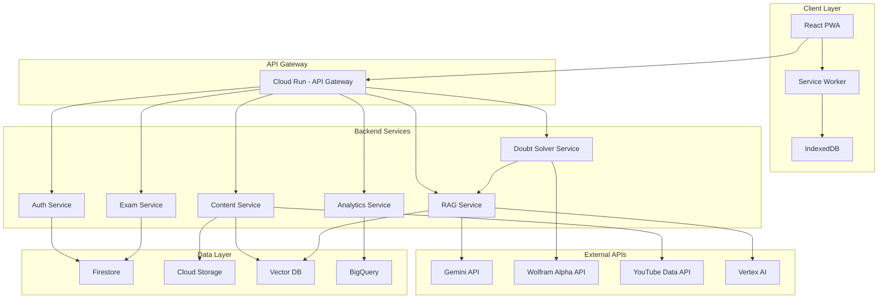
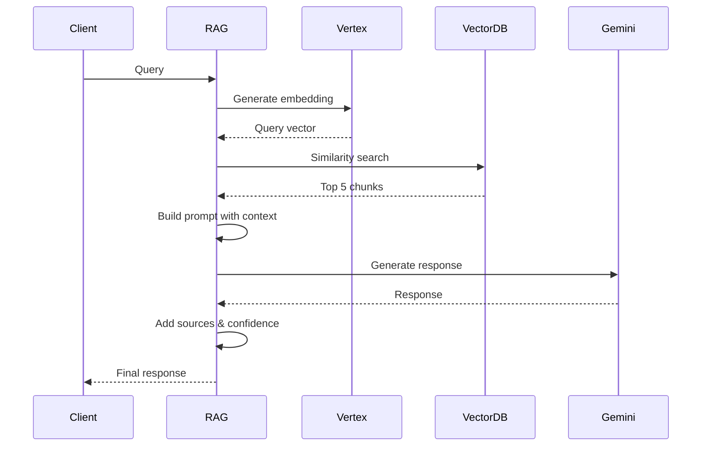

# Design Document

## Overview

The Class 12 Learning Platform is a full-stack web application built with React (frontend) and Python/FastAPI (backend), leveraging Google Cloud infrastructure for scalability. The system implements a RAG (Retrieval-Augmented Generation) pipeline powered by Vertex AI embeddings and Gemini LLM, integrated with Wolfram|Alpha for mathematical verification and YouTube Data API for video content.

The architecture follows a microservices pattern with separate FastAPI services for content management, RAG processing, and analytics. The frontend is a Progressive Web App (PWA) supporting offline-first capabilities through service workers and IndexedDB.

**Key Design Principles:**
- Student-first UX with minimal cognitive load
- Offline-capable with local-first data storage
- Scalable async Python backend with FastAPI
- Privacy-by-design with encrypted PII
- Adaptive learning through continuous feedback loops

## Architecture

### High-Level Architecture Diagram



### Technology Stack

**Frontend:**
- React 18 with TypeScript
- Vite for build tooling
- TailwindCSS + shadcn/ui for UI components
- React Router for navigation
- TanStack Query for data fetching
- Zustand for state management
- Workbox for service worker/PWA
- IndexedDB (via Dexie.js) for offline storage

**Backend:**
- Python 3.11+ with FastAPI
- Uvicorn ASGI server
- Pydantic for data validation
- Google Cloud Run (containerized services)
- Supabase for database and auth
- SQLAlchemy or direct Supabase client

**Google Cloud Services:**
- Cloud Run: Serverless container hosting
- Vertex AI: Embeddings generation, model hosting
- Cloud Storage: Media files, content packs
- Firestore: User profiles, progress, real-time data
- Cloud SQL (PostgreSQL): Structured content metadata
- BigQuery: Analytics and reporting
- Cloud Functions: Background jobs, triggers

**External APIs:**
- Google Gemini API (via Vertex AI or google-generativeai)
- Wolfram|Alpha API (wolframalpha library)
- YouTube Data API v3 (google-api-python-client)
- Google Cloud Vision API (google-cloud-vision)
- Google Speech-to-Text API (google-cloud-speech)

**Vector Database:**
- Vertex AI Matching Engine or Pinecone (pinecone-client)

**Python Libraries:**
- fastapi - Web framework
- uvicorn - ASGI server
- pydantic - Data validation
- supabase-py - Database client
- google-cloud-aiplatform - Vertex AI
- google-generativeai - Gemini API
- langchain - RAG orchestration
- numpy - Vector operations
- pandas - Data processing
- redis-py - Caching
- python-multipart - File uploads
- python-dotenv - Environment variables
- slowapi - Rate limiting
- pytest - Testing

## Components and Interfaces

### Frontend Components

#### 1. Authentication Module

**Components:**
- `LoginPage`: Email/password login form
- `SignupPage`: Student registration with subject selection
- `ProfileSetup`: Initial profile configuration
- `AuthProvider`: Context provider for auth state

**Backend Models (Pydantic):**
```python
from pydantic import BaseModel
from enum import Enum
from datetime import datetime

class Subject(str, Enum):
    MATHEMATICS = "mathematics"
    PHYSICS = "physics"
    CHEMISTRY = "chemistry"
    BIOLOGY = "biology"

class User(BaseModel):
    id: str
    email: str
    name: str
    role: str  # 'student' | 'admin'
    subjects: list[Subject]
    created_at: datetime
```

#### 2. Student Dashboard Module

**Components:**
- `StudentDashboard`: Main dashboard with micro-plan, progress, streaks
- `MicroPlanCard`: Daily 15-min learning plan
- `ProgressOverview`: Mastery scores by subject/topic
- `StreakDisplay`: Daily streak counter with badges
- `SubjectGrid`: Quick access to subjects

**Backend Models (Pydantic):**
```python
class MicroPlan(BaseModel):
    id: str
    date: datetime
    concept_summary: ContentItem
    pyqs: list[PYQ]
    hots_question: HOTSQuestion
    quiz: Quiz
    estimated_minutes: int

class MasteryScore(BaseModel):
    topic_id: str
    score: float  # 0-100
    last_updated: datetime
    questions_attempted: int
    correct_answers: int
```

#### 3. Doubt Solver Module

**Components:**
- `DoubtSolver`: Main interface with multi-modal input
- `TextInput`: Text question input
- `ImageUpload`: Image upload with preview
- `VoiceRecorder`: Audio recording interface
- `DoubtResponse`: Formatted response with NCERT, PYQ, HOTS
- `WolframSteps`: Step-by-step solution display

**Backend Models (Pydantic):**
```python
class DoubtQuery(BaseModel):
    id: str
    type: str  # 'text' | 'image' | 'voice'
    content: str
    subject: Subject | None = None
    timestamp: datetime

class DoubtResponse(BaseModel):
    query_id: str
    ncert_summary: str
    solved_example: ContentItem | None = None
    related_pyq: PYQ
    hots_question: HOTSQuestion
    wolfram_steps: list[WolframStep] | None = None
    sources: list[Source]
    confidence: float
```

#### 4. Homework Assistant Module

**Components:**
- `HomeworkInterface`: Question input with homework flag
- `HintDisplay`: Progressive hint revelation
- `AnswerInput`: Student answer submission
- `FeedbackPanel`: Answer evaluation and feedback

**Interfaces:**
```typescript
interface HomeworkSession {
  questionId: string;
  hintsRevealed: number;
  attempts: Attempt[];
  isComplete: boolean;
}

interface Attempt {
  answer: string;
  timestamp: Date;
  isCorrect: boolean;
  feedback: string;
}
```

#### 5. Exam Mode Module

**Components:**
- `ExamSelector`: PYQ set selection by subject/year
- `TimedTest`: Test interface with timer
- `QuestionNavigator`: Question grid navigation
- `TestResults`: Score breakdown and model answers
- `PerformanceTrends`: Historical test performance

**Interfaces:**
```typescript
interface ExamSet {
  id: string;
  subject: Subject;
  year: number;
  duration: number; // minutes
  totalMarks: number;
  questions: ExamQuestion[];
}

interface TestSession {
  examSetId: string;
  startTime: Date;
  endTime?: Date;
  answers: Map<string, string>;
  score?: number;
}
```

#### 6. Video Assistant Module

**Components:**
- `VideoLibrary`: Curated video list by topic
- `VideoPlayer`: Embedded player with timestamp navigation
- `TranscriptView`: Searchable transcript
- `BookmarkManager`: Saved videos

**Interfaces:**
```typescript
interface CuratedVideo {
  id: string;
  youtubeId: string;
  title: string;
  topicIds: string[];
  timestamps: Timestamp[];
  transcript: string;
}

interface Timestamp {
  time: number; // seconds
  label: string;
  topicId: string;
}
```

#### 7. Admin Panel Module

**Components:**
- `AdminDashboard`: Overview metrics and alerts
- `ContentManager`: Upload and tag content
- `StudentOversight`: Student list with filters
- `StudentProfile`: Detailed student progress
- `ContentPreview`: RAG pipeline preview
- `ReportExporter`: CSV export functionality

**Interfaces:**
```typescript
interface ContentItem {
  id: string;
  type: 'ncert' | 'pyq' | 'hots' | 'video';
  subject: Subject;
  chapter: string;
  topic: string;
  difficulty: 'easy' | 'medium' | 'hard';
  content: string;
  metadata: Record<string, any>;
}

interface AdminMetrics {
  activeStudents: number;
  avgMasteryScore: number;
  completionRate: number;
  flaggedStudents: StudentAlert[];
}
```

### Backend Services

#### 1. Auth Service (Handled by Supabase - Frontend integration only)

**Note:** Authentication is handled by Supabase on the frontend. Backend endpoints verify JWT tokens from Supabase.

**Database Schema:**
```sql
CREATE TABLE users (
  id UUID PRIMARY KEY,
  email VARCHAR(255) UNIQUE NOT NULL,
  password_hash VARCHAR(255) NOT NULL,
  name VARCHAR(255) NOT NULL,
  role VARCHAR(20) NOT NULL,
  created_at TIMESTAMP DEFAULT NOW()
);

CREATE TABLE user_subjects (
  user_id UUID REFERENCES users(id),
  subject VARCHAR(50) NOT NULL,
  PRIMARY KEY (user_id, subject)
);
```

#### 2. Content Service

**Endpoints:**
- `POST /content/upload` - Upload content (admin)
- `PUT /content/:id` - Update content metadata
- `GET /content/:id` - Get content by ID
- `GET /content/search` - Search content
- `POST /content/reindex` - Trigger embedding reindex

**Responsibilities:**
- Content CRUD operations
- Metadata tagging
- YouTube video curation
- Embedding generation via Vertex AI
- Vector database indexing

**Database Schema:**
```sql
CREATE TABLE content (
  id UUID PRIMARY KEY,
  type VARCHAR(20) NOT NULL,
  subject VARCHAR(50) NOT NULL,
  chapter VARCHAR(255),
  topic VARCHAR(255),
  difficulty VARCHAR(20),
  content TEXT NOT NULL,
  metadata JSONB,
  embedding_id VARCHAR(255),
  created_at TIMESTAMP DEFAULT NOW()
);

CREATE TABLE videos (
  id UUID PRIMARY KEY,
  youtube_id VARCHAR(50) NOT NULL,
  title VARCHAR(500),
  transcript TEXT,
  timestamps JSONB,
  topic_ids UUID[]
);
```

#### 3. RAG Service

**Endpoints:**
- `POST /rag/query` - Process RAG query
- `POST /rag/embed` - Generate embeddings
- `GET /rag/similar` - Find similar content

**Responsibilities:**
- Query embedding generation
- Vector similarity search
- Context retrieval (top-k)
- LLM prompt construction
- Gemini API integration
- Response formatting with sources

**RAG Pipeline Flow:**


#### 4. Doubt Solver Service

**Endpoints:**
- `POST /doubt/text` - Text question
- `POST /doubt/image` - Image upload
- `POST /doubt/voice` - Voice recording
- `GET /doubt/history` - User doubt history

**Responsibilities:**
- Multi-modal input processing
- OCR via Cloud Vision API
- Speech-to-text via Speech API
- Subject/concept classification
- RAG query orchestration
- Wolfram API integration
- Response composition (NCERT + PYQ + HOTS)

**Processing Flow:**
```python
async def process_doubt(query: DoubtQuery) -> DoubtResponse:
    # 1. Extract text from input
    text = await extract_text(query)
    
    # 2. Classify subject and concept
    classification = await classify_query(text)
    
    # 3. RAG retrieval
    rag_results = await rag_service.query(text, classification)
    
    # 4. Check if numerical - send to Wolfram
    wolfram_steps = None
    if is_numerical(text):
        wolfram_steps = await wolfram_service.solve(text)
    
    # 5. Compose response
    return DoubtResponse(
        query_id=query.id,
        ncert_summary=rag_results.ncert,
        solved_example=rag_results.example,
        related_pyq=rag_results.pyq,
        hots_question=await generate_hots(classification.topic),
        wolfram_steps=wolfram_steps,
        sources=rag_results.sources,
        confidence=rag_results.confidence
    )
```

#### 5. Exam Service

**Endpoints:**
- `GET /exam/sets` - List available exam sets
- `POST /exam/start` - Start timed test
- `PUT /exam/answer` - Submit answer
- `POST /exam/submit` - Submit complete test
- `GET /exam/results/:id` - Get test results
- `GET /exam/history` - Test history

**Responsibilities:**
- Exam set management
- Timer enforcement
- Answer evaluation
- Score calculation
- Performance tracking

#### 6. Analytics Service

**Endpoints:**
- `GET /analytics/dashboard` - Admin dashboard metrics
- `GET /analytics/student/:id` - Student analytics
- `POST /analytics/export` - Export reports
- `GET /analytics/trends` - Performance trends

**Responsibilities:**
- Aggregate metrics calculation
- BigQuery integration
- Report generation
- Student flagging logic

## Data Models

### Core Entities

```python
from pydantic import BaseModel
from enum import Enum
from datetime import datetime

class Subject(str, Enum):
    MATHEMATICS = "mathematics"
    PHYSICS = "physics"
    CHEMISTRY = "chemistry"
    BIOLOGY = "biology"

class Preferences(BaseModel):
    daily_goal_minutes: int
    notifications_enabled: bool

class Student(User):
    subjects: list[Subject]
    preferences: Preferences
    progress: Progress

class Progress(BaseModel):
    user_id: str
    mastery_scores: dict[str, MasteryScore]
    streak: int
    last_active_date: datetime
    total_minutes: int
    achievements: list[Achievement]

class ContentChunk(BaseModel):
    id: str
    content_id: str
    text: str
    embedding: list[float]
    metadata: dict

class PYQ(BaseModel):
    id: str
    subject: Subject
    year: int
    question: str
    solution: str
    marks: int
    topic_ids: list[str]

class HOTSQuestion(BaseModel):
    id: str
    subject: Subject
    topic_id: str
    question: str
    solution: str
    difficulty: str = "hard"
    type: str  # 'case_based' | 'application'
```

### Firestore Collections

```
users/
  {userId}/
    profile: { name, email, role, subjects }
    progress: { masteryScores, streak, achievements }
    
sessions/
  {sessionId}/
    userId, type, startTime, endTime, data
    
microplans/
  {date}_{userId}/
    items, completed, generatedAt
    
bookmarks/
  {userId}/
    videos: [videoId, ...]
```

### Cloud SQL Schema

```sql
-- Content metadata
CREATE TABLE topics (
  id UUID PRIMARY KEY,
  subject VARCHAR(50) NOT NULL,
  chapter VARCHAR(255) NOT NULL,
  name VARCHAR(255) NOT NULL,
  order_index INT
);

-- PYQ database
CREATE TABLE pyqs (
  id UUID PRIMARY KEY,
  subject VARCHAR(50) NOT NULL,
  year INT NOT NULL,
  question TEXT NOT NULL,
  solution TEXT NOT NULL,
  marks INT,
  topic_ids UUID[]
);

-- HOTS questions
CREATE TABLE hots_questions (
  id UUID PRIMARY KEY,
  subject VARCHAR(50) NOT NULL,
  topic_id UUID REFERENCES topics(id),
  question TEXT NOT NULL,
  solution TEXT NOT NULL,
  type VARCHAR(50)
);

-- Test sessions
CREATE TABLE test_sessions (
  id UUID PRIMARY KEY,
  user_id UUID REFERENCES users(id),
  exam_set_id UUID,
  start_time TIMESTAMP,
  end_time TIMESTAMP,
  score DECIMAL,
  answers JSONB
);
```

## Error Handling

### Error Categories

1. **Authentication Errors**
   - Invalid credentials → 401 with message
   - Expired session → 401 with redirect to login
   - Insufficient permissions → 403 with message

2. **Validation Errors**
   - Invalid input → 400 with field-specific errors
   - Missing required fields → 400 with list of missing fields

3. **External API Errors**
   - Wolfram API failure → Fallback to LLM with disclaimer
   - Gemini API rate limit → Queue request, show loading state
   - YouTube API error → Show cached data or graceful message

4. **RAG Pipeline Errors**
   - Low confidence (<70%) → Show "No relevant content found" with suggestions
   - Embedding generation failure → Retry once, then fallback to keyword search
   - Vector DB timeout → Return cached results if available

5. **Offline Mode Errors**
   - Content not cached → Show download prompt
   - Sync failure → Queue for retry, show sync status

### Error Response Format

```typescript
interface ErrorResponse {
  error: {
    code: string;
    message: string;
    details?: any;
    retryable: boolean;
  };
}
```

### Retry Strategy

- Network errors: Exponential backoff (1s, 2s, 4s)
- Rate limits: Wait for retry-after header
- Transient failures: Max 3 retries
- Critical operations: Store in queue for background retry

## Testing Strategy

### Unit Tests

**Frontend:**
- Component rendering tests (React Testing Library)
- Hook logic tests
- Utility function tests
- State management tests

**Backend:**
- Service method tests
- API endpoint tests (supertest)
- Database query tests
- External API mock tests

**Coverage Target:** 80% for critical paths

### Integration Tests

- Auth flow (signup → login → profile)
- Doubt solver end-to-end (input → RAG → response)
- Exam mode (start → answer → submit → results)
- Content upload → embedding → retrieval
- Offline sync (cache → offline use → sync)

### E2E Tests (Playwright)

- Student journey: Login → Dashboard → Doubt → Micro-plan
- Admin journey: Login → Upload content → View students
- Offline mode: Download pack → Go offline → Use content

### Performance Tests

- RAG query latency: <2s p95
- Embedding generation: <500ms per query
- Dashboard load: <1s p95
- Concurrent users: 1000+ simultaneous

### Load Tests (k6)

- Simulate 10,000 students
- Peak load: 500 req/s
- Sustained load: 100 req/s
- Database connection pooling validation

## Security Considerations

### Authentication & Authorization

- JWT tokens with 1-hour expiry
- Refresh tokens with 7-day expiry
- Role-based access control (RBAC)
- Admin routes protected by middleware

### Data Encryption

- TLS 1.3 for all API communication
- AES-256 encryption for PII at rest
- Encrypted Firestore fields for sensitive data
- Secure key management via Secret Manager

### Input Validation

- Sanitize all user inputs
- File upload validation (type, size)
- Rate limiting: 100 req/min per user
- SQL injection prevention via Prisma ORM

### Privacy

- GDPR-compliant data handling
- Parental consent flow for minors
- Data export API
- Right to deletion implementation
- Age-appropriate content filtering

### API Security

- API key rotation every 90 days
- Wolfram/YouTube API keys in Secret Manager
- CORS configuration for allowed origins
- Request signing for sensitive operations

## Deployment Architecture

### Google Cloud Run Services

```yaml
services:
  - name: api-gateway
    image: gcr.io/project/api-gateway
    resources:
      limits:
        cpu: 2
        memory: 2Gi
    autoscaling:
      minInstances: 1
      maxInstances: 100
      
  - name: rag-service
    image: gcr.io/project/rag-service
    resources:
      limits:
        cpu: 4
        memory: 8Gi
    autoscaling:
      minInstances: 2
      maxInstances: 50
```

### CI/CD Pipeline

1. **Build:** GitHub Actions
2. **Test:** Run unit + integration tests
3. **Build Docker images:** Multi-stage builds
4. **Push to GCR:** Google Container Registry
5. **Deploy to Cloud Run:** Rolling update
6. **Smoke tests:** Verify deployment
7. **Rollback:** Automatic on failure

### Monitoring

- Cloud Monitoring for metrics
- Cloud Logging for centralized logs
- Error Reporting for exception tracking
- Uptime checks for critical endpoints
- Custom dashboards for business metrics

### Backup & Disaster Recovery

- Firestore: Automatic daily backups
- Cloud SQL: Point-in-time recovery (7 days)
- Cloud Storage: Versioning enabled
- RTO: 4 hours
- RPO: 1 hour

## Offline-First Implementation

### Service Worker Strategy (Frontend)

```javascript
// Cache-first for static assets
workbox.routing.registerRoute(
  /\.(js|css|png|jpg|svg)$/,
  new workbox.strategies.CacheFirst()
);

// Network-first for API calls with fallback
workbox.routing.registerRoute(
  /\/api\//,
  new workbox.strategies.NetworkFirst({
    networkTimeoutSeconds: 3,
    cacheName: 'api-cache'
  })
);

// Background sync for mutations
workbox.backgroundSync.registerQueue('api-queue');
```

### Content Pack Structure

```json
{
  "packId": "math-ch1-v1",
  "subject": "mathematics",
  "chapter": "Relations and Functions",
  "version": 1,
  "size": "45MB",
  "contents": {
    "ncert": ["chunk1.json", "chunk2.json"],
    "pyqs": ["pyq_2023.json", "pyq_2022.json"],
    "videos": ["video1.mp4"],
    "transcripts": ["transcript1.json"],
    "embeddings": ["embeddings.bin"]
  }
}
```

### IndexedDB Schema (Frontend)

```javascript
const db = new Dexie('LearningPlatform');
db.version(1).stores({
  contentPacks: 'id, subject, chapter',
  contentChunks: 'id, packId, type',
  embeddings: 'id, chunkId',
  progress: 'userId, lastSynced',
  pendingSync: '++id, type, timestamp'
});
```

## Performance Optimizations

### Frontend

- Code splitting by route
- Lazy loading for heavy components
- Image optimization (WebP, lazy loading)
- Virtual scrolling for long lists
- Debounced search inputs
- Memoization for expensive computations

### Backend

- Connection pooling (max 100 connections)
- Query result caching (Redis)
- Batch embedding generation
- Async processing for non-critical tasks
- CDN for static assets (Cloud CDN)

### Database

- Indexed columns: userId, subject, topicId, timestamp
- Materialized views for analytics
- Partitioning for large tables (by date)
- Query optimization with EXPLAIN ANALYZE

### RAG Pipeline

- Pre-computed embeddings for all content
- ANN index for fast similarity search
- Batch processing for multiple queries
- Caching frequent queries (1-hour TTL)
- Streaming responses for long generations

## Scalability Considerations

### Horizontal Scaling

- Stateless services for easy scaling
- Load balancing via Cloud Run
- Database read replicas for analytics
- Sharding strategy for user data (by userId hash)

### Vertical Scaling

- RAG service: 8GB RAM for embedding models
- Database: Scale up during peak hours (8am-10pm)
- Vector DB: Dedicated high-memory instances

### Cost Optimization

- Cloud Run: Scale to zero during low traffic
- Committed use discounts for base capacity
- Lifecycle policies for old content (archive after 2 years)
- Compression for stored content
- Efficient embedding models (smaller dimensions)

## Future Enhancements

1. **Mobile Apps:** Native iOS/Android apps
2. **Live Classes:** Real-time video integration
3. **Peer Learning:** Student discussion forums
4. **Gamification:** Leaderboards, challenges
5. **Multi-language:** Hindi, regional languages
6. **Voice Assistant:** Conversational AI tutor
7. **AR/VR:** Immersive science experiments
8. **Adaptive Testing:** CAT-style assessments
